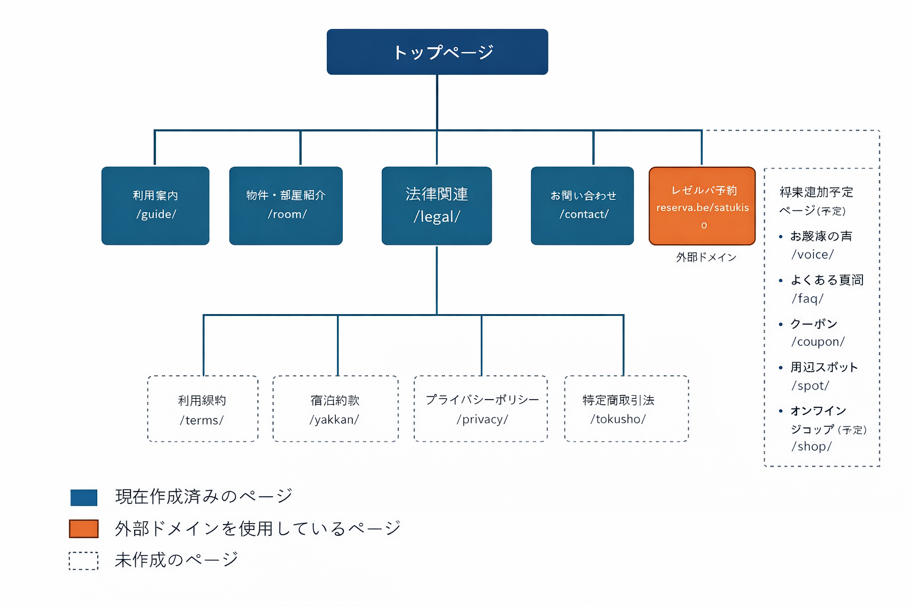

# 五月荘 公式Webサイト 制作案件 README

## 1. 案件概要
名古屋市千種区にある古民家民泊「五月荘」の公式Webサイト制作案件です。
宿泊検討者に対して施設の魅力・立地・料金感・利用方法を分かりやすく伝え、
予約・問い合わせへスムーズに誘導することを目的としています。

既存のOTA（Airbnb等）に依存せず、  
**公式サイトとしての信頼性・情報集約性**を重視して設計しました。

---

## 2. 使用ツール・技術選定理由

- **WordPress**  
  バニラPHPでの開発経験はあるものの、実案件・運用を想定した制作においては  
  「最短で安定したWebサイトを構築できるCMS」としてWordPressが最適と判断しました。  
  また、今後の案件対応を見据え、WordPress実務スキルの習得も目的の一つとしています。
  テーマはオリジナルのテーマを作成し使用しています。

- **PHP / CSS / JavaScript**  
  既に扱い慣れている技術スタックであり、  
  テーマ調整・細かなUI制御・パフォーマンス面の改善を柔軟に行うために使用しています。

- **Swiper.js（スライダー）**  
  jQueryに依存せず、軽量かつモダンに実装できるスライダーライブラリのため採用。  
  表示速度と保守性を考慮し、不要に重いライブラリは使用していません。

- **Contact Form（WordPressプラグイン）**  
  お問い合わせフォームを最短かつ最低限の構成で実装できるため採用。  
  運用側の管理負荷を増やさないことを重視しました。

- **Rank Math SEO（WordPressプラグイン）**  
  WordPressにおけるSEO管理は専用プラグインによる一元管理が最適と判断。  
  各ページのtitle・meta description設定を目的に導入しています。

- **InfinityFree（本番環境）**  
  URLとして公開・確認できる環境を用意するため、無料で利用可能な海外サーバーを採用。  
  国内無料サーバーではドメイン制約等が多いため、実用性を優先しました。

- **無料ドメイン**  
  初期コスト削減のため無料ドメインを使用。  
  技術検証・公開用途として十分と判断しています。  
  参考： https://github.com/DigitalPlatDev/FreeDomain

- **Cloudflare（DNS / SSL）**  
  DNS管理およびSSL対応のために使用。  
  セキュリティ・安定性・速度面のバランスが良く、無料枠でも実用的なため採用しました。

- **Reserva（予約システム）**  
  無料かつ簡易的ではあるものの、  
  「最低限の予約導線」を構築できる外部サービスとして連携しています。

- **Canva**  
  画像加工・簡単なビジュアル調整に使用。  
  Photoshop / Illustratorを使用せずとも短時間で制作できる点を重視しました。

- **ChatGPT**  
  ページ文章の下書き・表現整理・構成案作成の補助として使用。  
  最終的な判断・調整・実装はすべて人手で行っています。

- **Google Maps**  
  アクセス情報の分かりやすさを重視し、  
  地図埋め込みとして使用しています。

- **遅延読み込み（Lazy Loading）**  
  画像・不要なリソースは初期表示時に読み込まず、  
  表示速度改善のため遅延読み込みを実施しています。

## 3. サイト構成

本サイトは、宿泊検討者が必要な情報へ迷わず辿り着けるよう、
シンプルかつ段階的な構成を採用しています。

### 公開ページ一覧

- **トップページ**  
  https://kyabetukun.dpdns.org/  
  施設の概要・魅力を端的に伝え、各ページへの導線を配置

- **部屋紹介**  
  https://kyabetukun.dpdns.org/room/  
  客室・設備情報の詳細掲載

- **利用案内**  
  https://kyabetukun.dpdns.org/guide/  
  チェックイン方法、注意事項などを集約

- **アクセス**  
  https://kyabetukun.dpdns.org/access/  
  Googleマップ埋め込みによる所在地案内

- **よくある質問（FAQ）**  
  https://kyabetukun.dpdns.org/faq/  
  利用前の疑問点を事前に解消するためのページ

- **お問い合わせ**  
  https://kyabetukun.dpdns.org/contact/  
  宿泊・取材等の問い合わせ窓口

- **外部予約システム（Reserva）**  
  https://reserva.be/satukiso  
  無料で利用可能な簡易予約導線として連携

- **404ページ**  
  存在しないURLアクセス時の案内ページ

---

### 将来的なページ追加候補

- **利用規約**  
  https://kyabetukun.dpdns.org/legal/terms/

- **宿泊約款**  
  https://kyabetukun.dpdns.org/legal/yakkan/

- **プライバシーポリシー**  
  https://kyabetukun.dpdns.org/legal/privacy/

- **特定商取引法表記**  
  https://kyabetukun.dpdns.org/legal/tokusho/

---

- 周辺観光情報ページ
- お知らせ・更新情報ページ
- お客様の声（レビュー）ページ
- 500ページなど

※運用状況に応じて段階的に追加可能な構成としています。

---

## 4. 制作手順

1. **要件整理・掲載情報の洗い出し**  
   ホテル・旅館・民泊など同ジャンルのWebサイトを複数調査し、  
   デザイン手法・導線設計・情報の見せ方を比較。  
   メリット・デメリットを整理した上で、ロールモデルとなる参考サイトを選定。

2. **サイト構成・導線設計**  
   掲載すべき情報（施設概要、部屋情報、アクセス、利用案内、問い合わせ等）を整理し、  
   各ページで使用するツール・外部サービス（フォーム、予約システム等）を選定。

3. **WordPress 環境構築**  
   ローカル環境にてサーバー準備およびWordPressの初期設定を実施。  
   本番公開を前提とした構成で環境構築を行う。

4. **各固定ページの作成**  
   以下の順序で段階的にページを構築：  
   フッター → ヘッダー → お問い合わせ → アクセス → 利用案内 → 部屋紹介 → トップページ  
   各工程ごとに写真撮影・配置、レスポンシブ対応を並行して実施。

5. **本番サーバー環境およびサイト公開設定**  
   無料ドメイン・無料サーバーの調査および選定を行い、本番環境へ反映。  
   CloudflareによるDNS・SSL設定、外部予約システムとの連携を実施し、  
   実表示を確認。

6. **SEO 基本設定**  
   各ページのtitle・meta descriptionを設定し、  
   検索エンジン向けの基本的なSEO設定を実施。

7. **GitHub提出および最終調整**  
   表示確認、リンク切れ、表示速度などを最終チェック。  
   必要に応じて軽微な修正を行い、提出。

---

## 5. 工夫点・制約事項

### 工夫点

- **民泊イメージを崩さないデザイン設計**  
  使用する色数を最小限に抑え、  
  落ち着いたトーンを基調とすることで民泊らしい雰囲気を意識。  
  予約・問い合わせなどの導線は、  
  ボタンカラーやスマートフォン下部固定バーにより視認性を確保。

- **表示速度・パフォーマンスへの配慮**  
  画像の遅延読み込みを実施し、  
  不要なWordPressプラグインや外部ライブラリは使用しない方針とした。  
  JavaScript・CSSも必要な場面のみ読み込む構成とし、  
  表示速度の低下を防止。

- **情報設計のシンプル化**  
  1ページあたりの情報量を抑え、  
  宿泊検討者が迷わず情報を確認できる構成を意識。  
  FAQや法定ページは用途別に分離して配置。

- **予約・問い合わせ導線の最適化**  
  外部予約システムを主張しすぎず自然に配置し、  
  予約と問い合わせの両方を選択できる導線を設計。

- **将来的な拡張を見据えた構成**  
  周辺観光情報、レビュー、多言語対応など、  
  今後の拡張を前提にサイト構造を設計。
　今後部屋数が増えた場合などでも簡単に移行できるようなURL選定(room)

### 制約事項

- **写真素材のクオリティ**  
  写真はプロによる撮影ではなく、個人で撮影した素材を使用しているため、  
  画角やライティング、デザイン面においてプロ品質には及ばない部分がある。  
  今後、撮影環境の改善や写真の差し替えによる品質向上が可能。

- **SEO対策の範囲**  
  基本的なtitle・meta description設定は行っているものの、  
  サイトマップ生成やrobots.txt最適化など、  
  本格的なSEO施策に十分な時間を割けていない。  
  今後、検索流入強化のため改善余地がある。

- **ページ構成の限定**  
  今回は依頼範囲を優先し、必要最低限のページ構成としているため、  
  民泊サイトとして有用な「お客様の声」「詳細FAQ」などのページは未実装。  
  運用状況に応じて段階的な追加を想定。

- **多言語対応の未実装**  
  インバウンド需要を考慮すると多言語対応は有効だが、  
  今回は日本語対応のみとし、将来的な拡張項目としている。

- **予約管理システムの制約**  
  無料で利用可能な簡易予約システムを採用しているため、  
  Airbnb等のOTAと予約を自動同期する  
  サイトコントローラー機能（Beds24等）は未導入。  
  有料サービス導入により将来的な拡張が可能。

---

## 6. AIツール使用の有無と使用範囲

- **使用あり**
- **使用ツール**：ChatGPT

### 使用範囲

- **文章作成補助**  
  各ページの文章について、  
  初稿（たたき案）の作成、見出し・説明文の整理を目的として使用。  
  生成された文章をそのまま使用するのではなく、  
  内容の調整・表現修正・取捨選択を行った上で採用。

- **画像加工補助**  
  トップページの画像スライダーで使用している画像（3枚）について、  
  文字入れや構成案作成の補助として使用。

- **構成・実装サポート**  
  WordPressテーマ構成や functions.php の記述に関して、  
  実装方法の確認・参考情報の取得を目的に使用。

- **トラブルシューティング**  
  開発・構築過程で発生したエラーや不具合について、  
  原因特定や解決方針の検討補助として使用。

### 使用していない範囲

- サイト設計・構成の意思決定
- コーディング内容の最終判断
- 公開環境への反映作業

※設計判断・最終調整・実装はすべて手動で対応しています。

---

## 7. サイト構成図

※青色は現在作成済みのページ、点線は未作成（将来追加予定）ページを示しています。  
※外部予約システムは外部ドメイン（Reserva）と連携しています。

---

## 8. 各ページ原稿について

本サイトで使用している各固定ページの原稿は、
下記のディレクトリ内に Markdown 形式でまとめています。

- /docs/pages/

---

## 9. 画像素材一覧

本サイトで使用している画像素材の一覧および管理方針は、
以下のファイルおよびディレクトリにまとめています。

- /docs/images.md（画像素材一覧・用途・著作権区分）
- /satukiso-theme/img/（実際に使用している画像ファイル）

---

## 10. 各種設定内容の記録（概要）

- お問い合わせフォーム：
  - Contact Form 7 を使用
  - InfinityFree 環境の制約により、SMTP（WP Mail SMTP / Gmail API）を利用して送信

- SEO：
  - Rank Math を使用
  - 現在は構築段階のため、全ページ noindex 設定

- DNS / SSL：
  - Cloudflare を利用し HTTPS 化および DNS 管理を実施

- 予約機能：
  - 外部予約サービス「Reserva」と連携

- 本番環境：
  - InfinityFree（無料プラン）を使用

- CMS：
  - WordPress を使用
  - 固定ページによるサイト構成
  - 自作テーマを使用

※ 各設定の詳細は以下を参照  
- /docs/settings.md

---

